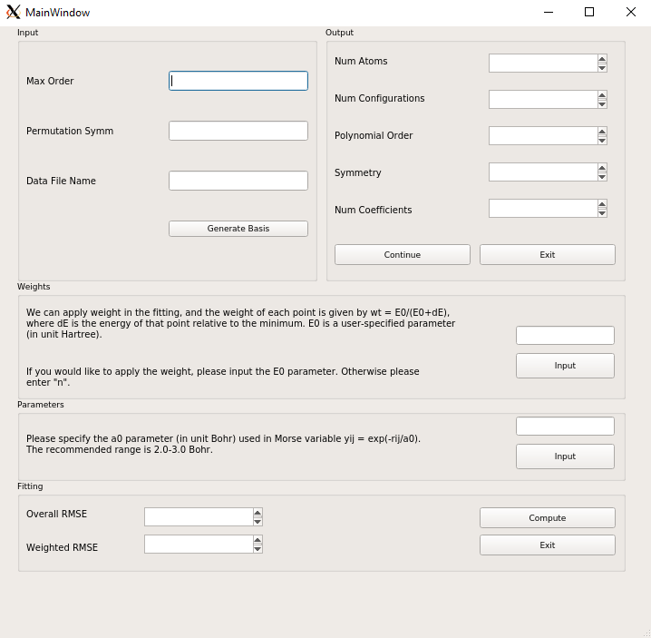

### Instructions for Version 0.02

Input:
* Max Order: Input the polynomial order you would like to use for the fitting. (example: 4)
* Permutation Symm: Input the molecular formula (or the permutational symmetry group). (example: 2 2 1)
* Data File Name: Input the name of the data file. (example: points.dat)
* Generate Basis: Uses the data provided in previous steps to generate basis. 

Output: 
* The program displays the number of coefficients and the number of configurations in the data file. If the number of coefficients is too small (which leads to large fitting error) or too large (which may cause over-fitting), you can Exit the program and then pick another polynomial order. You can Continue if satisfied.
* Continue: Saves the values in an output.txt file. Moves on to next step.
* Exit: Saves the values in an output.txt file and terminates program.

Weights: 
* Input: If you would like to apply weight, just input the parameter. If you do not want to add weight, just enter "n". Moves on to next step.

Parameters: 
* Input: Enter the a0 parameter you would like to use. We recommend values between 2.0 and 3.0 Bohr. Moves on to next step.

Fitting: The program fits the potential energy surface and when it finishes, the root-mean-square fitting error (RMSE) and weighted RMSE are displayed. The coefficients of the fit is written in "coeff.dat", and three Fortran code files "pes_shell.f90", "basis.f90", and "gradient.f90" are also generated.
* Compute: Generates fits and displays RMSE.
* Exit: Saves the values in an output.txt file and terminates program.

