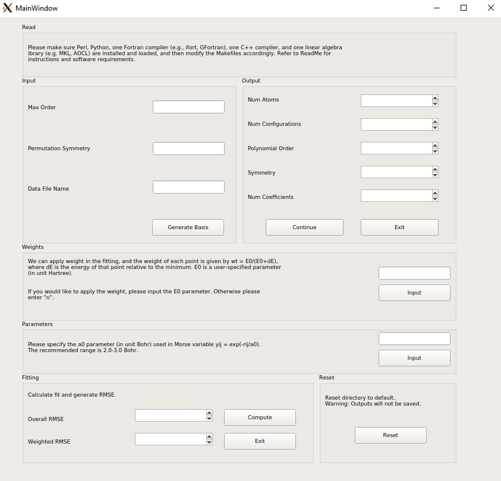

## Python Graphical User Interface (GUI) Application for Monomial Symmetrization for Potential Energy Surface (PES) Fitting

### Description

This program provides an easy-to-use, Python-based graphical user interface (GUI) for running MSA software. MSA is a software that does a fit of electronic energies using fitting bases that are invariant with respect to permutations of like atoms. 

### Software Used

Requirements: To use this software, you need a Fortran 90, a C++ compiler, a linear algebra library, Perl and Python. Ensure Makefiles reflect any adjustments. 

MSA Software:
* Python 3.8.8 / Spyder
* [Perl 5.34.0](https://www.activestate.com/products/perl/)
* Ubuntu 20.04 - Linux Environment (Windows Store)
* build-essential (g++ compiler, sudo apt-get install build-essential)
* [Intel® oneAPI Base Toolkit for Linux](https://www.intel.com/content/www/us/en/developer/tools/oneapi/base-toolkit-download.html): 
    (1) Intel® oneAPI Math Kernel Library

* [Intel® oneAPI HPC Toolkit for Linux](https://www.intel.com/content/www/us/en/developer/tools/oneapi/hpc-toolkit-download.html):
    (1) Intel® Fortran Compiler Classic
    (2) Intel® C++ Compiler Classic
* Helpful [link](https://estuarine.jp/2021/03/install-oneapi/?lang=en) for tips on properly initializing ifort. <!--- (i.e. source /opt/intel/oneapi/setvars.sh) -->

GUI Development:
* PyQt5 5.15.6
* pyqt5-tools > [QtDesigner](https://doc.qt.io/qt-5/qtdesigner-manual.html) 
* [Helpful tutorial](https://www.techwithtim.net/tutorials/pyqt5-tutorial/how-to-use-qtdesigner/)

Working in Ubuntu 20.04:
* [Xming](https://sourceforge.net/projects/xming/)
* [Anaconda for Linux](https://www.digitalocean.com/community/tutorials/how-to-install-the-anaconda-python-distribution-on-ubuntu-20-04)


### Breakdown of Directories (adapted from [Original Work by Kee Wang and Group](https://github.com/Kee-Wang/PES-Fitting-MSA)):
After downloading and unzipping the "MSA", the following folders and
files should be in the package:

1. A folder called "src", which contains the source codes. Inside it there are:
    - A folder called "emsa", which contains the C++ codes that generate the monomials and polynomials.
    - a test program "getpot.f90" that uses the fitted potential to calculate the potential of a given geometry.
    - A Makefile that is used to compile the Fortran codes.
    - A test data file "test.xyz" that contains an arbitrary geometry of the H2-H2O. This test data is used by the "getpot" program and the expected output is written in the file "expected.out".
    - Two Perl scripts.

2. A example data file "points.dat" that contains 44623 geometries of H2-H2O and the corresponding interaction energies. This is the database used to fit the potential.

3. Three Python files which will be used for running the GUI and finding the fit. 'msa_main.py' and 'msa_kernel.py' are responsible for functions behind the GUI's modules. 'msa_ui.py' is responsible for the GUI layout, created using PyQt5 package. 

4. A UI file which can be run using QtDesigner to make any modifications to the GUI layout. 

5. An image file of the GUI application.

6. This 'ReadMe.MD' file. 

### Instructions for Version 0.07 (adapted from [Original Work by Kee Wang and Group](https://github.com/Kee-Wang/PES-Fitting-MSA)):

Using Linux environment, use command: 
```
python3 msa_main.py 
```


1. Input:
    - Max Order: Input the polynomial order you would like to use for the fitting. The number of coefficients increases rapidly when the polynomial order becomes larger. So you may want
        to start with low polynomial orders. (example: 4) 
    - Permutation Symmetry: Input the molecular formula (or the permutational symmetry group). (example: 2 2 1)
        - Our example is H2-H2O, and we use 2 2 1 here. The full symmetry is 4 1, but we don't expect any H exchange between H2 and H2O, so 2 2 1 is also a reasonable choice.
    - Data File Name: Input the name of the data file. (example: points.dat)
    - Generate Basis: Uses the data provided in previous steps to generate basis. Two Fortran code files will be generated: 'gradient.f90' and 'basis.f90.'

2. Output: The program displays the number of coefficients and the number of configurations in the data file. If the number of coefficients is too small (which leads to large fitting error) or too large (which may cause over-fitting), you can Exit the program and then pick another polynomial order. You can Continue if satisfied.
    - Continue: Saves the values in an output.txt file. Moves on to next step.
    - Exit: Saves the values in an output.txt file and terminates program.

3. Weights: The program asks you if you would like to apply weight to the points in the fitting. 
    - Input: If you would like to apply weight, input the parameter. If you do not want to add weight, enter "n". Moves on to next step.

4. Parameters: The program asks you to input the a0 parameter (in unit Bohr) used in the Morse variable yij = exp(-rij/a0). 
    - Input: Enter the a0 parameter you would like to use. We recommend values between 2.0 and 3.0 Bohr. Moves on to next step.

5. Fitting: The program fits the potential energy surface and when it finishes, the root-mean-square fitting error (RMSE) and weighted RMSE are displayed. The coefficients of the fit are written in 'coeff.dat' and the Fortran code 'pes_shell.f90' is generated. 
    - Compute: Generates fits and displays RMSE.
    - Exit: Saves the values in an output.txt file and terminates program.

6. Reset: 
    - Resets the directory to default. Removes everything, including ALL output files. Be sure to save all desired files in another location prior to resetting.
    - Terminates program when finished.


7. The test program "getpot.x" is compiled, and if you would like to run
    the test, use the command
    ```
    ./getpot.x test.xyz
    ```
    The results is written in test.out.
 
8. If you would like to use the fit in your own program, 'pes_shell.f90,' 'basis.f90,' 'gradient.f90,' and 'coeff.dat' are necessary. Copy these four files to the folder that contains your own program, and in your own Fortran code, insert "use pes_shell", and "call pes_init()", (as we do in the "getpot.f90" example), and you can calculate the potential of any configuration using the "f" function, and the gradient using the "g" function.


### Acknowledgements

Collaborators: Dr. Joel Bowman, Dr. Chen Qu
If you have any questions, please contact [Jeffrey Li](jeffrey.k.li98@gmail.com) or [Dr. Chen Qu](szquchen@gmail.com).